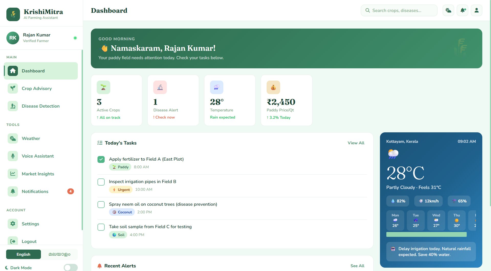
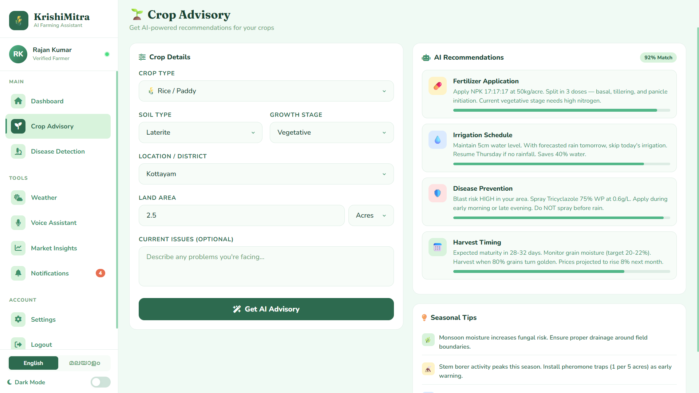
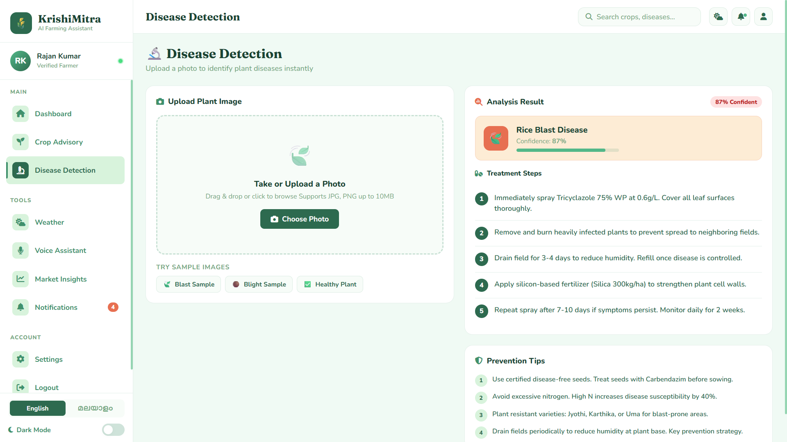
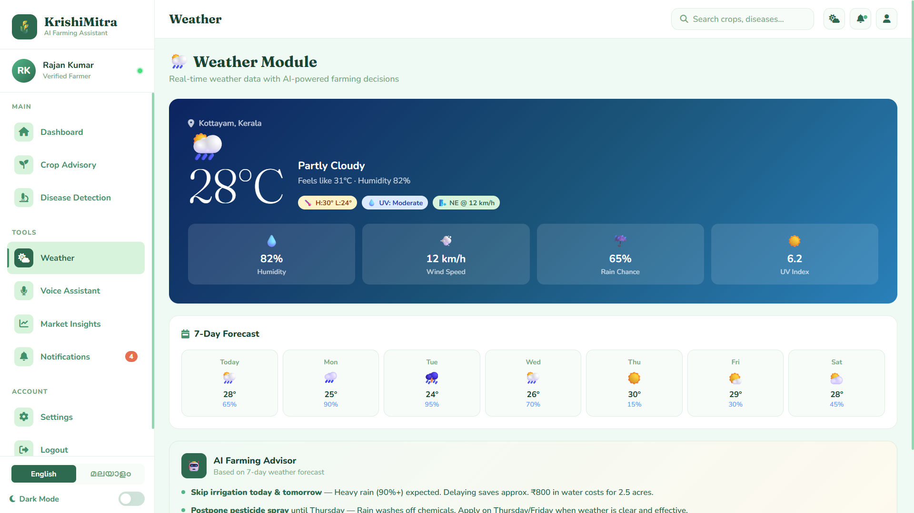
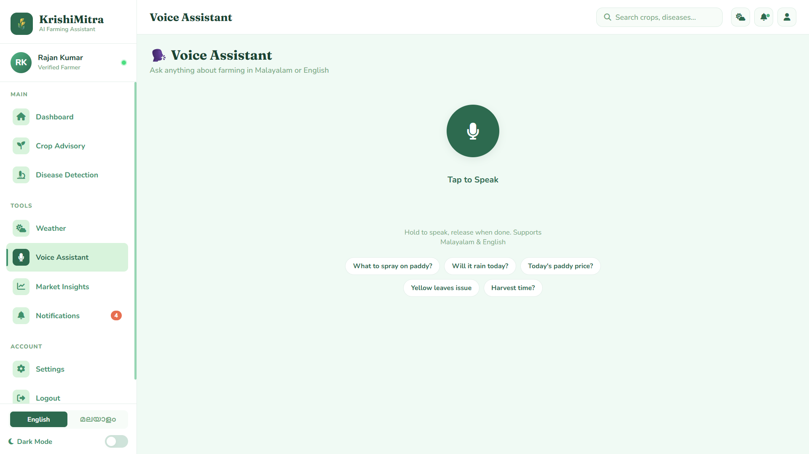
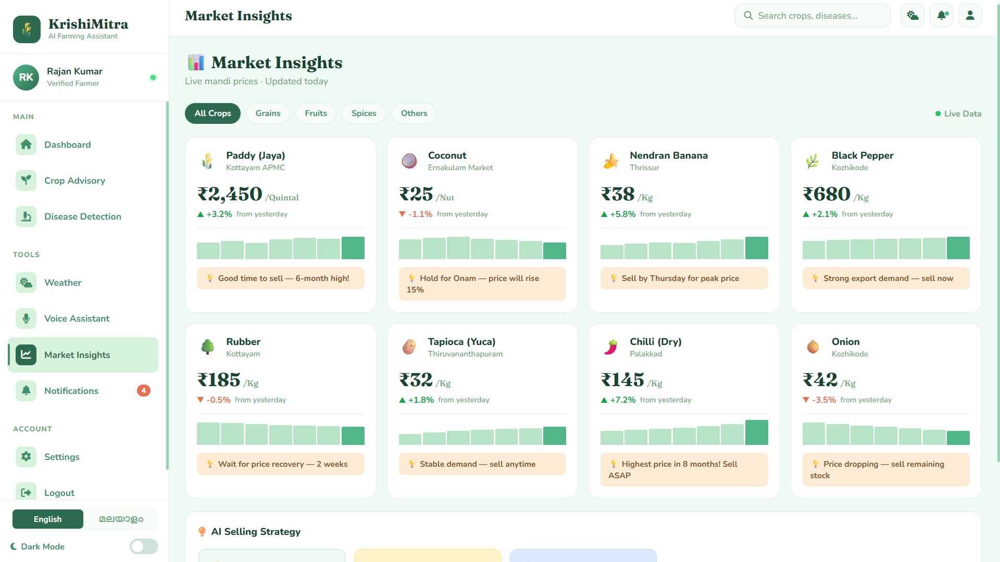
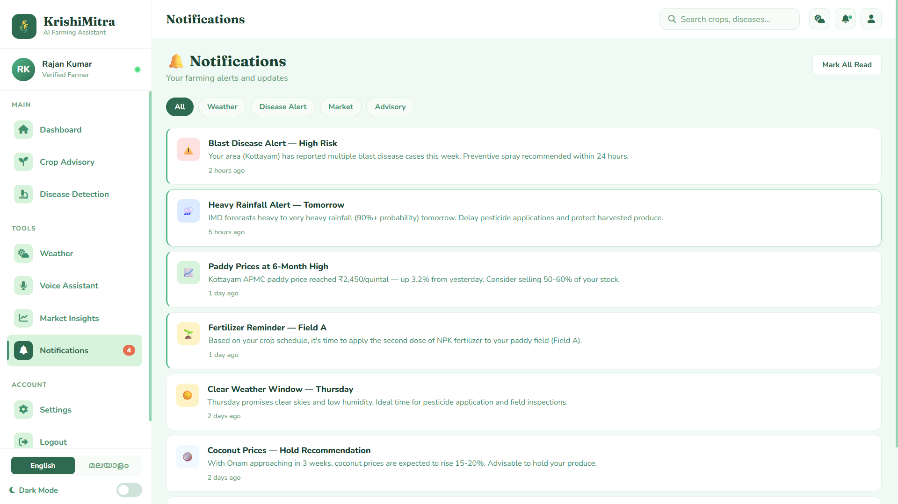

<div align="center">


<br/>

[](https://github.com/)
[](https://github.com/)
[](https://github.com/)
[](https://github.com/)
[](https://github.com/)
[](https://github.com/)

<br/>

<h3><em>കൃഷിമിത്ര AI — Empowering every farmer with the intelligence of a thousand agronomists.</em></h3>
<p><strong>Real-time decisions &nbsp;·&nbsp; Local language &nbsp;·&nbsp; Zero complexity.</strong></p>

<br/>

</div>

---

## 🌿 What is KrishiMitra AI?

**KrishiMitra AI** is a full-stack, AI-powered smart farming web application built specifically for **Kerala farmers**. It combines real-time weather intelligence, AI crop advisory, instant disease detection, live market prices, and a Malayalam voice assistant — all in one beautiful, mobile-ready interface.

> 🔬 *Built for farmers who grow crops, not code.*

---

## 🖼️ App Showcase

### 🔐 Login & Authentication

<div a lign="center">
  
  <br/><br/>
  <kbd>✨ Elegant split-panel</kbd> &nbsp; <kbd>🌿 Green gradient branding</kbd> &nbsp; <kbd>🚀 One-click demo access</kbd>
</div>

<br/>

---

### 🏠 Dashboard — Your Farm's Mission Control

<div align="center">
  
  <br/><br/>
  <kbd>📊 Live stat cards</kbd> &nbsp; <kbd>✅ Task checklist</kbd> &nbsp; <kbd>🌦️ Weather widget</kbd> &nbsp; <kbd>🔔 Smart alerts</kbd>
</div>

<br/>

| Stat Cards | Weather Widget | Task Manager |
|:---:|:---:|:---:|
| 🌱 Active Crops | ☁️ Live 28°C Kottayam | ✅ Daily checklist |
| 🔬 Disease Alerts | 📅 7-day forecast | 🏷️ Priority tags |
| 💰 Paddy Price/Qt | 🤖 AI rain advice | 📈 Progress tracking |

---

### 🌱 Crop Advisory — AI Recommendations

<div align="center">
  
  <br/><br/>
  <kbd>🌾 Crop Type</kbd> → <kbd>🪨 Soil Type</kbd> → <kbd>🌿 Growth Stage</kbd> → <kbd>📍 Location</kbd> → <kbd>✨ AI Advisory</kbd>
</div>

<br/>

**Sample AI Output — 92% Confidence Match:**

| # | Recommendation | Confidence |
|:---:|---|:---:|
| 💊 | Apply NPK 17:17:17 at 50kg/acre · Split in 3 doses | `████████████ 94%` |
| 💧 | Skip irrigation today — heavy rain forecast tomorrow | `███████████ 88%` |
| 🛡️ | Spray Tricyclazole 75% WP — blast risk is HIGH | `█████████████ 97%` |
| 📅 | Harvest window: 28-32 days · Target 80% golden grains | `██████████ 79%` |

---

### 🔬 Disease Detection — Instant Plant Diagnosis

<div align="center">
  
  <br/><br/>
  <kbd>📸 Upload Photo</kbd> → <kbd>🤖 AI Analyzes</kbd> → <kbd>🩺 Treatment Plan</kbd> → <kbd>🛡️ Prevention Tips</kbd>
</div>

<br/>

| Disease Detected | Confidence | Steps |
|---|:---:|:---:|
| 🍃 Rice Blast *(Magnaporthe oryzae)* | **87%** | 5-step spray protocol |
| 🟤 Bacterial Leaf Blight *(Xanthomonas)* | **91%** | Copper oxychloride regimen |
| ✅ Healthy Plant — No Disease | **96%** | Continue current routine |

---

### 🌦️ Weather Module — AI Farming Decisions

<div align="center">
  
  <br/><br/>
  <kbd>🌡️ 28°C</kbd> &nbsp; <kbd>💧 82% Humidity</kbd> &nbsp; <kbd>💨 12 km/h Wind</kbd> &nbsp; <kbd>☔ 65% Rain Chance</kbd> &nbsp; <kbd>☀️ UV 6.2</kbd>
</div>

<br/>

**🤖 AI Farming Advisor — Based on 7-Day Forecast:**

```
⏭️  Skip irrigation today & tomorrow   → Heavy rain (90%+) expected · Saves ₹800
🚫  Postpone pesticide spray            → Rain washes off chemicals · Apply Thu/Fri
⚠️  High blast risk TODAY              → Apply Tricyclazole BEFORE the rain arrives
🌾  Harvest window                     → Clear skies Thursday–Friday, ideal conditions
```

---

### 🗣️ Voice Assistant — Speak in Malayalam

<div align="center">
  
  <br/><br/>
  <kbd>🎤 Malayalam</kbd> &nbsp; <kbd>🇬🇧 English</kbd> &nbsp; <kbd>🔊 Spoken Responses</kbd> &nbsp; <kbd>💊 Quick Pills</kbd>
</div>

<br/>

| 🎤 You Say | 🤖 KrishiMitra Responds |
|---|---|
| *"നെൽകൃഷിയിൽ എന്ത് തളിക്കണം?"* | Spray Tricyclazole 75% WP at 0.6g/L — early morning |
| *"ഇന്ന് മഴ ഉണ്ടാകുമോ?"* | Yes! 90% rainfall tomorrow — skip irrigation |
| *"ഇന്നത്തെ നെല്ല് വില?"* | ₹2,450/quintal at Kottayam APMC — 6-month high! |
| *"മഞ്ഞ ഇല — എന്ത് രോഗം?"* | Likely N-deficiency or Leaf Blight — upload photo |
| *"വിളവെടുപ്പ് എന്ന്?"* | 28-32 days · Harvest when 80% grains turn golden |

---

### 📊 Market Insights — Live Mandi Prices

<div align="center">
  
  <br/><br/>
  <kbd>🔴 Live Data</kbd> &nbsp; <kbd>📈 Mini Charts</kbd> &nbsp; <kbd>🤖 AI Sell Strategy</kbd> &nbsp; <kbd>🏷️ Category Filters</kbd>
</div>

<br/>

| Crop | Price | Change | 🤖 AI Advice |
|---|:---:|:---:|---|
| 🌾 Paddy (Jaya) · Kottayam APMC | **₹2,450/Qt** | 🟢 ▲ +3.2% | **SELL NOW** — 6-month high! |
| 🥥 Coconut · Ernakulam | **₹25/Nut** | 🔴 ▼ -1.1% | **HOLD** — Onam surge in 3 weeks |
| 🍌 Nendran Banana · Thrissur | **₹38/Kg** | 🟢 ▲ +5.8% | **Sell by Thursday** — peak price |
| 🌶️ Chilli (Dry) · Palakkad | **₹145/Kg** | 🟢 ▲ +7.2% | **8-month high — Sell ASAP!** |
| 🌿 Black Pepper · Kozhikode | **₹680/Kg** | 🟢 ▲ +2.1% | Strong export demand |
| 🌳 Rubber · Kottayam | **₹185/Kg** | 🔴 ▼ -0.5% | Wait 2 weeks for recovery |

---

### 🔔 Notifications — Smart Farming Alerts

<div align="center">
  
  <br/><br/>
  <kbd>🔴 Disease</kbd> &nbsp; <kbd>🔵 Weather</kbd> &nbsp; <kbd>🟢 Market</kbd> &nbsp; <kbd>🟡 Advisory</kbd> &nbsp; <kbd>✅ Mark All Read</kbd>
</div>

<br/>

```
🔴  Blast Disease Alert — High Risk           2 hours ago  [UNREAD]
🔵  Heavy Rainfall Alert — Tomorrow           5 hours ago  [UNREAD]
🟢  Paddy Prices at 6-Month High              1 day ago    [UNREAD]
🟡  Fertilizer Reminder — Field A             1 day ago    [UNREAD]
⛅  Clear Weather Window — Thursday           2 days ago
🥥  Coconut Prices — Hold Recommendation      2 days ago
🔬  Stem Borer Sighting Reported Nearby       3 days ago
```

---

## ✨ Complete Feature Set

<div align="center">

| Feature | Description | Status |
|:---:|:---|:---:|
| 🤖 **AI Crop Advisory** | Soil-specific, stage-aware fertilizer, irrigation & pest recommendations | ✅ Live |
| 🔬 **Disease Detection** | Photo-based instant diagnosis with step-by-step treatment plans | ✅ Live |
| 🌦️ **Weather Module** | 7-day forecast with AI-generated farming action list | ✅ Live |
| 🗣️ **Voice Assistant** | Malayalam + English speech recognition with spoken responses | ✅ Live |
| 📊 **Market Insights** | Live mandi prices across Kerala + AI sell/hold strategy | ✅ Live |
| 🔔 **Smart Alerts** | Disease risk, weather, market & advisory push notifications | ✅ Live |
| 🌙 **Dark Mode** | Full dark theme with smooth animated transition | ✅ Live |
| 🇮🇳 **Bilingual UI** | Instant toggle between English and Malayalam | ✅ Live |
| 📱 **Mobile First** | Bottom navigation, touch-optimized, fully responsive | ✅ Live |
| ✅ **Task Manager** | Daily farming checklist with priority tags & tracking | ✅ Live |

</div>

---

## 🏗️ Tech Stack

```
┌─────────────────────────────────────────────────────────┐
│                    KrishiMitra AI                       │
├──────────────┬────────────────────┬─────────────────────┤
│   Frontend   │     APIs / AI      │      Modules        │
├──────────────┼────────────────────┼─────────────────────┤
│ HTML5        │ Web Speech API     │ 🌱 Crop Advisory    │
│ CSS3         │ SpeechSynthesis    │ 🔬 Disease Detect   │
│ Vanilla JS   │ AI Response Engine │ 🌦️  Weather Module  │
│ Font Awesome │ Canvas API         │ 📊 Market Insights  │
│ Google Fonts │ FileReader API     │ 🗣️  Voice Assistant │
│ CSS Variables│ Geolocation API    │ 🔔 Notifications    │
└──────────────┴────────────────────┴─────────────────────┘
```

**Design System:**
- 🎨 CSS Custom Properties (Design Tokens) for full theme control
- 🌿 Green palette: `#082018` → `#D8F3DC` — earth & nature inspired
- 🟠 Alert accent: `#E76F51` for urgency & disease warnings
- 🔤 Typography: `Fraunces` (display) + `Nunito` (UI text)
- ✨ Animations: `float`, `ripple`, `shimmer`, `wave`, `pulse`, `toastIn`

---

## 🚀 Getting Started

```bash
# 1. Clone the repository
git clone https://github.com/yourusername/krishimitra-ai.git

# 2. Navigate to project folder
cd krishimitra-ai

# 3. Open directly in browser — zero build step!
open index.html
```

> ✅ **Zero dependencies.** No npm. No webpack. No setup. Just open and use.

**Demo Login:**
```
📱 Phone:    +91 98765 43210
🔑 Password: farmer123
             ── or ──
👆 Click:   "Try Demo Account" button
```

---

## 🗂️ Project Structure

```
krishimitra-ai/
│
├── 📄 index.html              # Complete single-file application
│   ├── 🎨 <style>             # 1,200+ lines of crafted CSS
│   │   ├── Auth Screens       # Login & Sign Up panels
│   │   ├── Dashboard          # Stats, tasks, weather, alerts
│   │   ├── Crop Advisory      # Form + AI recommendation cards
│   │   ├── Disease Detection  # Upload zone + result panel
│   │   ├── Weather Module     # Big weather card + forecast grid
│   │   ├── Voice Assistant    # Mic UI + waveform + transcript
│   │   ├── Market Insights    # Price cards + mini charts
│   │   └── Notifications      # Alert list + filters
│   │
│   └── ⚙️ <script>            # App logic & state management
│       ├── Translation Engine  # EN ↔ ML (100% coverage)
│       ├── Navigation Router   # View switching
│       ├── Voice Assistant     # Web Speech API integration
│       ├── Disease Engine      # Photo analysis & results
│       ├── Market Renderer     # Dynamic price card builder
│       └── Notification System # Alert management & filters
│
├── 📁 screenshots/            # App screenshots
│   ├── login.png
│   ├── dashboard.png
│   ├── crop-advisory.png
│   ├── disease-detection.png
│   ├── weather.png
│   ├── voice-assistant.png
│   ├── market-insights.png
│   └── notifications.png
│
└── 📖 README.md               # You are here! 👋
```

---

## 🌐 Bilingual Support

| Language | Code | UI Coverage | Voice Recognition | Voice Output |
|---|:---:|:---:|:---:|:---:|
| 🇬🇧 English | `en` | 100% | ✅ `en-IN` | ✅ `en-IN` |
| 🇮🇳 Malayalam (മലയാളം) | `ml` | 100% | ✅ `ml-IN` | ✅ `ml-IN` |

---

## 📱 Responsive Breakpoints

| Device | Viewport | Layout |
|---|:---:|---|
| 🖥️ Desktop | > 1024px | Fixed sidebar + scrollable main content |
| 💻 Tablet | 768–1024px | Collapsible sidebar + dark overlay |
| 📱 Mobile | < 768px | Bottom navigation bar + full-screen views |

---

## 🤝 Contributing

1. 🍴 **Fork** the repository
2. 🌿 **Create** your branch: `git checkout -b feature/amazing-feature`
3. 💾 **Commit**: `git commit -m 'Add amazing feature'`
4. 📤 **Push**: `git push origin feature/amazing-feature`
5. 🔃 **Open** a Pull Request

**Future roadmap ideas:**
- 🗺️ GPS-based auto location & field mapping
- 📷 Real TensorFlow.js model for disease detection
- 🔗 Kerala Agri Market live API integration
- 📲 PWA / Service Worker for full offline support
- 🛰️ Satellite imagery for crop health monitoring
- 🌡️ IoT soil sensor data integration

---

## 📜 License

```
MIT License — Free to use, modify & distribute.
Built with ❤️ for Kerala's farming community.
```

---

## 🙏 Acknowledgements

- 🌾 **Kerala State Horticulture Mission** — crop data references
- 🏛️ **IMD India** — weather pattern data & forecasting guidance
- 🧑‍🌾 **Farming communities** of Kottayam, Wayanad & Palakkad who inspired this
- 🔤 **Google Fonts** — Fraunces & Nunito typefaces
- 🎨 **Font Awesome** — iconography system

---

<div align="center">


<br/>

**Built with 🌿 for the farmers of Kerala**

*"When farmers prosper, the nation prospers."*

<br/>

[](https://github.com/)
[](https://github.com/)
[](https://github.com/)
[](https://github.com/)
[](https://github.com/)

<br/>

*KrishiMitra AI — കൃഷിമിത്ര AI* 🌾

</div>
